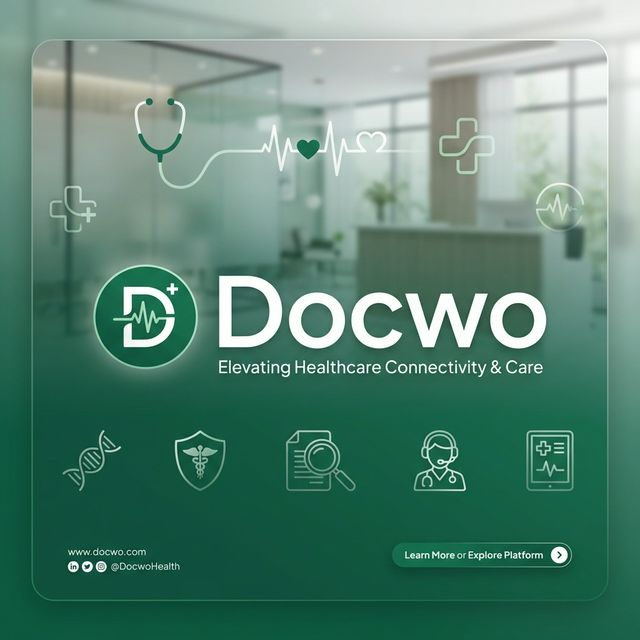

# 🏥 Docwo - Elevating Healthcare Connectivity

[](https://nextjs.org/)
[](https://www.typescriptlang.org/)
[](https://tailwindcss.com/)
[](https://opensource.org/licenses/MIT)



Docwo is a modern, high-performance healthcare platform designed to bridge the gap between patients and medical professionals. With a focus on speed, accessibility, and real-time data, Docwo streamlines the appointment booking process and enhances the patient experience through live token tracking and comprehensive portal management.

---

## ✨ Key Features

### 👤 Patient Portal

- **Smart Search**: Find doctors by specialty, location, or clinic.
- **Instant Booking**: Real-time availability and one-click appointment scheduling.
- **Live Token Tracking**: Monitor your place in the queue from anywhere.
- **Health Journey**: A personalized timeline of your medical history and upcoming visits.

### ⚕️ Staff & Admin Portals

- **Queue Management**: Effortlessly manage patient flow and appointment statuses.
- **Clinic Dashboard**: Comprehensive overview of daily schedules and doctor availability.
- **Patient Records**: Secure access to patient history and consultation notes.

---

## 🚀 Tech Stack

- **Framework**: [Next.js 15](https://nextjs.org/) (App Router)
- **Styling**: [Tailwind CSS 4](https://tailwindcss.com/) with [Shadcn UI](https://ui.shadcn.com/)
- **State Management**: [Redux Toolkit](https://redux-toolkit.js.org/) & [Zustand](https://docs.pmnd.rs/zustand/getting-started/introduction)
- **Data Fetching**: [TanStack Query (React Query)](https://tanstack.com/query/latest)
- **Animations**: [Framer Motion](https://www.framer.com/motion/)
- **Forms**: [React Hook Form](https://react-hook-form.com/) with [Zod](https://zod.dev/) validation
- **Backend Communication**: [Axios](https://axios-http.com/)

---

## 🛠️ Getting Started

### Prerequisites

- Node.js 18.x or later
- npm or yarn

### Installation

1. **Clone the repository**

    ```bash
    git clone https://github.com/Abhijith-Abi/Docwo-Web.git
    cd docwo-web
    ```

2. **Install dependencies**

    ```bash
    npm install
    ```

3. **Run the development server**

    ```bash
    npm run dev
    ```

4. **Build for production**
    ```bash
    npm run build
    ```

---

## 📸 Preview

The platform is designed with a premium, emerald-themed aesthetic that prioritizes readability and user comfort.

> [!TIP]
> Use the **Dashboard** to get a bird's eye view of your upcoming schedule and recent health activities.

---

## 📄 License

Distributed under the MIT License. See `LICENSE` for more information.

---

<p align="center">Built with ❤️ for a healthier tomorrow.</p>
